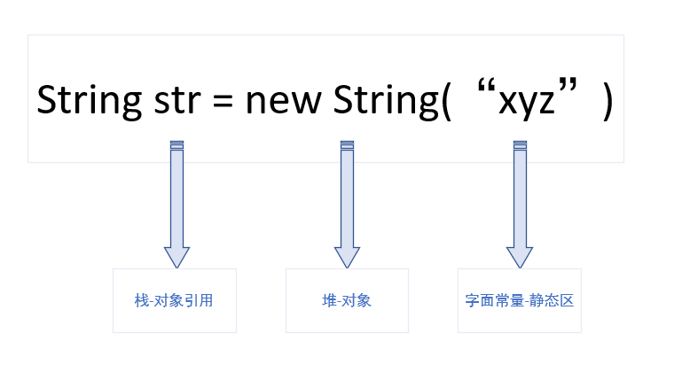

# 注解

## 一、工厂模式

​        工厂模式一边拿用于当我们创建复杂对象时，通过简单的new来创建会比较麻烦，这时候我们就可以使用工厂模式来创建一个工厂类，我们只需向工厂类中传入需要的类相关信息计科，工厂类中是吸纳了创建对象的复杂细节。

### 1、简单工厂模式

​       创建一个工厂类，在类中通过传入的参数不同创建不同的实体类。有新需求时需要更改工厂类中的代码，违背了开闭原则。

```java
//Car接口
interface Car{
    public  void factory();
}
//宝马实体类
class BWM implements Car{
	 public  void factory(){
		System.out.println("生产宝马！！！");
     }
}
//奥迪实体类
class Audi implements Car{
	 public  void factory(){
		System.out.println("生产奥迪！！！");
     }
}
//汽车简单工厂
public class CarFactory{
    public static Car carFactory(Calss<?>clazz){
       if(clazz.getName().equals(BWM.Class.getName())){
            return new BWM();
        }
       if(clazz.getName().equals(Audi.Class.getName())){
            return new Audi();
        }
        return null;
    }
}
//工厂测试
public class FactoryTest{
    public static void main(String[]args){
		Car car = CarFactory.carFactory(BMW.class);
        car.factory();
    }
}
//执行结果
生产宝马
```

### 2、多方法静态工厂

​      创建一个工厂类，在工厂类中写多个静态方法来创建对应的类。当有新的需求时，只需要增删工厂类中的静态方法就行了。

```java
//汽车简单工厂
public class CarFactory{
    public static Car BMWFactory(){
            return new BWM();
    }
    public static Car BMWFactory(){
            return new Audi();
    }
}
//工厂测试
public class FactoryTest{
    public static void main(String[]args){
		Car car = CarFactory.BMWFactory();
        car.factory();
    }
}
//执行结果
生产宝马
```

### 3、工厂方法模式

​       设置一个工厂接口，通过其他的类实现这个接口来创建实例。不仅实体要抽象，工厂也要抽象，由具体的工厂类来创建对象。当有新的需求时，只需要添加或者删除具体工厂类就行，不需要i需改已有的类中的代码。

```java
//抽像工厂
interface CarFactory{
	public Car carFactory(); 
}
//具体工厂类
class BWMFactory implements CarFactory{
	@Override
    public Car carFactory(){
		return new BWM;
    }
}
//具体工厂类
class AudiFactory implements CarFactory{
	@Override
    public Car carFactory(){
		return new Audi;
    }
}
//工厂测试
public class FactoryTest{
    public static void main(String[]args){
		Car car = AudiFactory.carFactory();
        car.factory();
    }
}
//执行结果
生产奥迪
```

### 4、抽象工厂模式

​        抽象工厂就是一个工厂不单生产一个种类的产品，而是生产多个种类的产品，也就是相关产品的产品家族，

```java
interface Plane{
	void PlaneFactory();
}

class BattlePlane implements Plane{
    public void planeFactory() {
        System.out.println("生产战斗机！");
    }
}
//抽象工厂
interface Factory{
    public Car carfactory();
    public Plane planefactory();
}

//具体工厂类
class FFfactory implements Factory{
    @Override
    public Car carfactory() {
        return new BMW();
    }
    @Override
    public Plane planefactory() {
        return new BattlePlane();
    }
}
//工厂测试
public class FactoryTest{
    public static void main(String[]args){
        Car BMW = new FFfactory().carfactory();
        BMW.factory();
        Plane BattlePlane =new FFfactory.planeFactory();
    	BattlePlane.planeFactory();	
    }
//测试结果
 生产宝马
 生产战斗机
```

工厂模式使用场景:

​      当我们直接new一个对象比较麻烦时，比如构造方法传参数量太多。

## 二、三种String类型的区别

### 1、String

​	String在Java编程中广泛应用，以下是**String源码**

```java
 private final char value[]
```

由此已知，String底层是一个final类型的数组，所以String的值是不可以轻易改变的。每次对String的操作都会生成新的String对象，造成内存浪费。

而**StringBuilder和StringBuffer源码**如下，底层是一个可变的字符数组，所以在频繁的字符串操作时，建议使用StringBuffer或StringBuilder。

```java
char []value;
```


### 2、StringBuffer、StringBuilder

StringBuffer和StringBuilder最大的不同在于，StringBuffer是线程安全的，上了同步锁，而StringBuilder不能同步访问。

### 3、三者效率比较

```java
public class Compare {
	public static void compareString() {
		String str = "";
		long begin = System.currentTimeMillis();
		for(int i=0;i<999999;i++) {
			str = str + i;
		}
		long end = System.currentTimeMillis();
		System.out.println("String增加字符串用时："+(end-begin)/1000+"秒");
	
	}
	public static void compareStringBuilder() {
		StringBuilder builder= new StringBuilder("");
		long begin = System.currentTimeMillis();
		for(int i=0;i<9999999;i++) {
			builder.append(i);
		}
		long end = System.currentTimeMillis();
		System.out.println("StringBuilder增加字符串用时："+(end-begin)+"毫秒");
	
	}
	public static void compareStringBuffer() {
		StringBuffer buffer = new StringBuffer("");
		long begin = System.currentTimeMillis();
		for(int i=0;i<9999999;i++) {
			buffer.append(i);
		}
		long end = System.currentTimeMillis();
		System.out.println("StringBuffer增加字符串用时："+(end-begin)+"毫秒");
	
	}

	public static void main(String[] args) {
//		Compare.compareString(); //时间太长不足计算
		Compare.compareStringBuilder();//813
		Compare.compareStringBuffer();//1120
	}
}
//output
StringBuilder增加字符串用时：813毫秒
StringBuffer增加字符串用时：1120毫秒
```

### 4、 String资源分配

**内存中的栈（stack）、堆（stack）、静态区的用法**

 栈:

+ 一个基本数据类型变量
+ 一个对象的引用
+ 函数调用的现场保存

堆： 

+ 通过new关键字的对象
+ 构造器创建

静态区：

+ 字面常量



## [三、作业要求代码实现](./src/com/couragehe/homework)