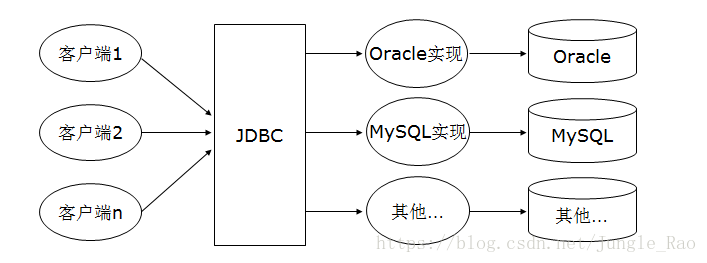

## JDBC连接mysql与SqlServer

### 一、JDBC梗概

&emsp;&emsp;在没有使用JDBC的情况下，如果要连接数据库进行操作，基本上必须使用数据库所提供的API，然而各个厂商所提供的API不一致，如果要使用A厂商的数据库，就必须设计专用程序来操作A厂商的数据库，将来若要改用B厂商的数据库，即使应用程序本身的目的相同，但在需要放问数据库的部分，也必须改写为操作B厂商数据库的程序，因此衍生了统一的就桥梁JDBC；

&emsp;&emsp;JDBC（**J**ava DataBase Connectivity）是Java和数据库之间的一个桥梁，是一个规范而不是一个实现，能够执行SQL语句。它由一组用[Java语言](https://baike.baidu.com/item/Java语言)编写的类和接口组成。



### 二、数据库的连接

#### 1、导入专用的jar包

&emsp;&emsp;根据自己的数据库版本采用不同的jar包版本，最好是自己多多试验一下。

```xml
<dependencies>
   	 //mysql jar包依赖
	  <dependency>
	    <groupId>mysql</groupId>
	    <artifactId>mysql-connector-Java</artifactId>
	    <version>5.1.3</version>
	</dependency>
      //sqlServer jar包依赖
	 <dependency>
	    <groupId>com.microsoft.sqlserver</groupId>
	    <artifactId>sqljdbc4</artifactId>
	    <version>4.0.0</version>
	</dependency>
  </dependencies>
```

#### 2、提供JDBC配置文件

```properties
#mysql链接参数
jdbc.username=root
jdbc.password=123456
jdbc.driver=com.mysql.jdbc.Driver
jdbc.url=jdbc:mysql://localhost:3306/cloud_note?characterEncoding=utf-8
```
```properties
#mssql链接参数
jdbc.username=sa
jdbc.password=123456
jdbc.driver=com.microsoft.sqlserver.jdbc.SQLServerDriver
jdbc.url=jdbc:sqlserver://127.0.0.1:1433;DatabaseName=demo
```

#### 3、获取数据库连接

```java
//读取配置文件
	public static void init(String path){
		Properties config = new Properties();
		InputStream in =  DBUtils.class.getClassLoader().getResourceAsStream(path);
		try {
			config.load(in);
			//初始化 连接参数
			driver = config.getProperty("jdbc.driver");
			url = config.getProperty("jdbc.url");
			username = config.getProperty("jdbc.username");
			password = config.getProperty("jdbc.password");
		} catch (IOException e) {
			e.printStackTrace();
		}
	}
//获取数据库连接
public static Connection getConnection() {
		try {
			Class.forName(driver);
			Connection conn = DriverManager.getConnection(url, username, password);
			return conn;
		} catch (SQLException e) {
			e.printStackTrace();
		} catch (ClassNotFoundException e) {
			e.printStackTrace();
		}
		return null;
		
	}
```

### 三、执行sql语句

```java
        DBUtils.init("mysql.properties");      
        Connection conn = DBUtils.getConnection();
		String sql = " select cn_note_title,cn_note_status_id from cn_note";
		Statement st = conn.createStatement();
		ResultSet rs = st.executeQuery(sql);
		String title = null;
		int status = 0;
		while(rs.next()){
			title = rs.getString("cn_note_title");
			status = rs.getInt("cn_note_status_id");
			System.out.println("title:"+title+"\nstatus:"+ status);
		}
		System.out.println(conn);
		DBUtils.close(conn);
```


